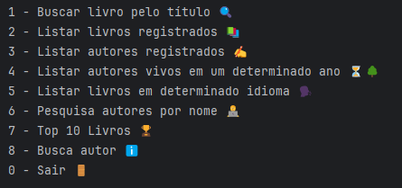

# Challenge Liter Alura

## 📱 Descrição
Neste desafio de programação, fui convidado a construir uma aplicação que recebe dados de uma api dados de livros e seus autores, os trata e salva em um banco de dados postgresql.

## 🎯 Objetivo
Desenvolver um Catálogo de Livros que ofereça interação textual (via console) com os usuários, proporcionando no mínimo 5 opções de interação. Os livros serão buscados através de uma API específica.

## 🚀 Funcionalidades
- Buscar Livro por Título via api
- Listar Todos os Livros Registrados no BD
- Listar Todos os Autores Registrados no BD
- Listar Autores Vivos em um Ano Específico
- Listar Livros por Idioma
- Pesquisar Autor por Nome no BD
- Top 10 Livros Mais Populares
- Busca Autor por nome via api

## 🛠️ Tecnologias Utilizadas
- IntelliJ IDEA
- Java
- Spring
- Gutendex API
- PostgreSQL

## Produzido por:
#### *Paulo Henrique Rosa*
- [Linkedin](https://www.linkedin.com/in/paulo-henrique-rosa-dev/)
- [Github](https://github.com/Paulo-back)

## 💻 Cursos do Projeto

✅ [Java consumindo API](https://cursos.alura.com.br/course/java-consumindo-api-gravando-arquivos-lidando-erros)

✅ [Java: trabalhando com lambdas, streams e Spring Framework](https://cursos.alura.com.br/course/java-trabalhando-lambdas-streams-spring-framework)

